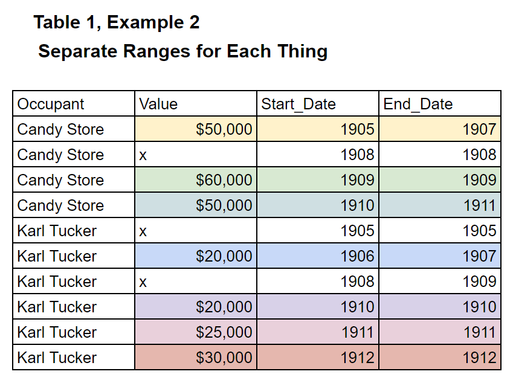
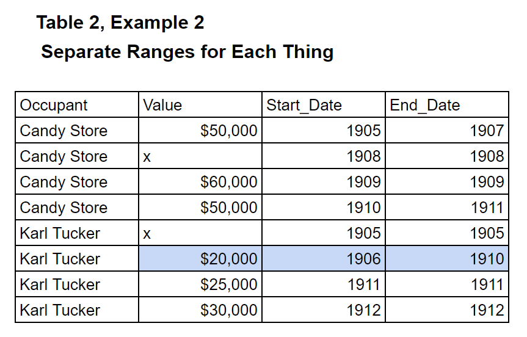

# Tables With 2 Number Ranges

This is for Example 2 given on the Readme.

This tool needs refinement, it's a hack and it's messy. In the meantime, here it is.
___

So far this is the table that this was used for.
It's a big table of settlements (cities, towns, etc) and their population in different years.

Table that's generated: [Example 2 Table](../master/chandlerV2.csv)

Table that's generated: [Example 2 Generated Table](../master/chandlerV2_storylayer.csv)

Code that's been used: [Sort of Sucky Example 2 Code](../master/chandlerV2_for_query.sql)

___
## Copying from the Readme

### Example 2: Places with addresses and how much money the places are worth.

This timeline could generate the following tables, or the tables could generate the timeline.
___
### Table 1 (for example 2)

This is a resulting table. It shows how much the places were worth over known dates. It can be used to create the timeline as well.

___
### Table 2 (for example 2)

This is another table that fills merges things further. This can be used to create a timeline as well.

*Note* - For sequencing, there should be an option to go backwards or forwards, or to leave out ranges at the beginning or ends of rows.

