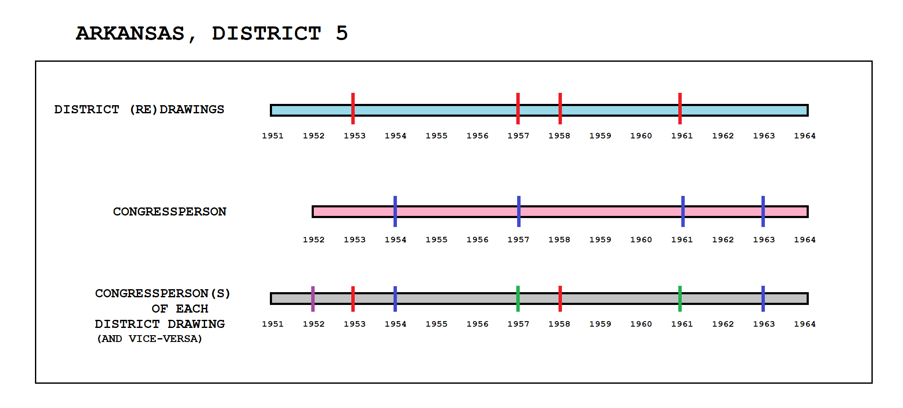
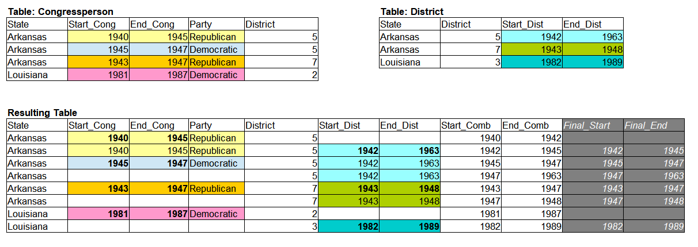
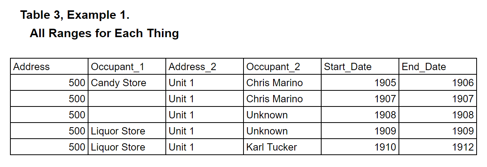

# Tables With 2 Number Ranges

This is a tool to take all the overlapping rows in a table and make them columns, so you can see all the stuff for any place at any time.

This is for Example 1, Table 3 given on the Readme.
___
This was developed for the use of combining congresspeople for each redrawing of their districts. It's a bit more well developed than other tools, but documentation is still needed.
___

Tables that are used:

[Congressperson](../master/congressperson.csv)

[Congresses](../master/congresses.csv)

[District_Table](../master/districts_table.csv)

Code that's been used: [Table 3, Example 1 Code](../master/cong_dist_queries.sql)

Table that's generated: [Table 3, Example 1 Generated Table](../master/congressperson_district_reduced.csv)

___
## Explanation of how this works

___
___
___
## Copying from the Readme

### Example 1: Places with addresses and who's there.

This timeline could generate the following tables, or the tables could generate the timeline.
 
___

### Table 3 (for example 1)

This is a table where everything that's in a place is showed at the same time.

