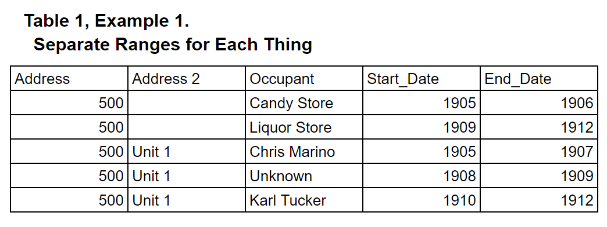
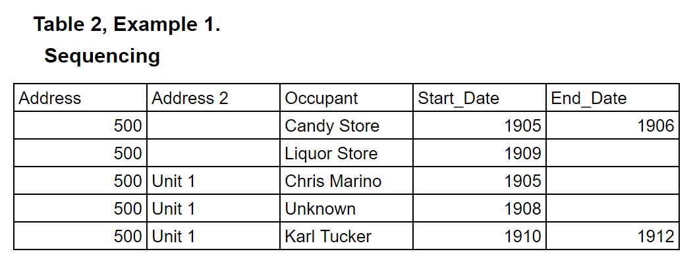

# Tool to Sequence Number Ranges

This is for Example 1, Table 2 in the Readme.
___

Sometimes you have a table with just start_dates or start_dates and end_dates with empty cells.

This sequences those dates.

This needs to be documented more clearly, and the resulting table needs to be added.

___
Table that's used: [Example 1, Table 2](../master/ollie_maps_csv.csv)

Table that's generated: (unavailable)

Codes that have been used: [Code 1](../master/createOriginal_2.sql), [Code 2](../master/years2.sql)

___
# Copying from the Readme

### Example 1: Places with addresses and who's there.

This timeline could generate the following tables, or the tables could generate the timeline.
 
___
### Table 1 (for example 1)

This is a simple table with all the dates filled in.

___
### Table 2 (for example 1)

Some cells don't have dates.
The rest of the dates have to be filled in.

